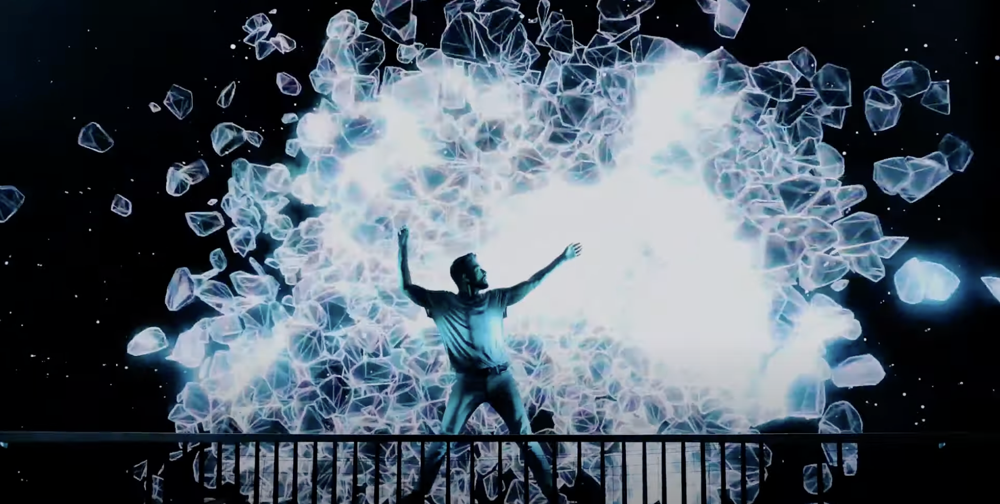

# XZEN0801_9103-Quiz
I was inspired by Daniel Stryjecki's multimedia performance. He achieved this project by combining dance moves and interactive animation techniques. The video shows the amazing interaction between light and the dancers' movements, extending the visuals while also amplifying the dancers' movements. As for how to present this art in my work, I think I can replace the dancer movement with the mouse operation. Click the mouse, long press the mouse, slide the mouse can control different animation effects.
Youtube link: [Link Text](https://www.youtube.com/watch?v=hw-TO1zOHVI)

The first coding technique that I found is to use a technique called a "particle system" in p5.js. This will simulate the visual effects of the explosion.
Particle system: 
[Link Text](https://p5js.org/zh-Hans/examples/simulate-particle-system.html)
An example of using particle system: 
[Link Text](https://editor.p5js.org/jcponce/sketches/b6CKYCV18)

The second is to using sound visualization, like amplitude analysis, beat detection and so on. The ability to respond to sound and present visual effects.
An example of sound visualization: 
[Link Text](https://editor.p5js.org/starbuck10/sketches/SA3P1zeDo)

Third is using Perlin noise to create a natural flow for dance movement in object lines, dots etc.
An example of berlin noise:
[Link Text](https://editor.p5js.org/datarav3/sketches/qNZa6PrKb)
